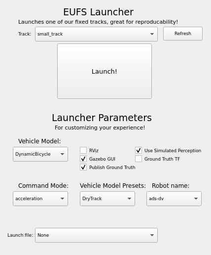

# Control system

To run this module natively, follow the installation guide below.

Alternatively, you can run this system using the docker-compose by following [this guide](../DOCKER_README.md).

**NOTE** using the docker is generally much easier than doing this by hand, however installing the prerequisites on your machine can make coding easier, due to better vscode syntax highlighting.

## 1. Prerequisites
This section should provide a guide to installing the requirements to run this module

### Mandatory:

-   Ubuntu 22.04 - while other linux versions might work, only ubuntu 22.04 has been tested
-   [ros2 humble](https://docs.ros.org/en/humble/Installation/Ubuntu-Install-Debs.html)

    -   After installing humble, it is a good idea to add the setup script to your .bashrc, like so:

    ```bash
    echo "source /opt/ros/humble/setup.bash" >> ~/.bashrc
    ```
    This means it will run automatically whenever a terminal is opened.


### Optional:
-   [EUFS sim](https://gitlab.com/eufs/eufs_sim) - this is a simulator that can be used to simulate interaction with the car


<br><br>

### After you have installed these, there is still some setup to do:

- First clone this repository, then in the root of this project:
```bash
git submodule init
git submodule update
```
- Then install some more dependencies:

```bash
sudo apt install python3-colcon-common-extensions python3-rosdep python3-numpy python3-scipy python3-matplotlib can-utils ros-humble-ackermann-msgs ros-humble-geometry-msgs ros-humble-std-msgs ros-humble-sensor-msgs ros-humble-std-srvs ros-humble-tf2 ros-humble-nav-msgs ros-humble-visualization-msgs
```

## 2. Compilation
- Start by moving into this directory, then 
```bash
colcon build --symlink-install --packages-select eufs_msgs
colcon build --symlink-install --packages-select ros_control
colcon build --symlink-install --packages-select ros_can
. install/setup.bash
```
## 3. Running the system

- To ensure that python can find all the imports use:
```bash
export PYTHONPATH="$PYTHONPATH:/'your path to here'/ros_control/ros_control"
```
To save doing this every time, add it to your .bashrc

- To ensure that ros_can can connect to the can bus, use:
```bash
sh "your path to here"/ros_can/FS-AI-API/setup.sh
```
Again, to avoid doing this in every terminal add it to your .bashrc

**NOTE** it is normal for this to say 'Cannot find device "can0"', because this device is only for a physical can bus. Our program uses vcan0.

**The next step depends on if you are using the eufs sim or not**

- If using the sim, launch it using:
```bash
ros2 launch eufs_launcher eufs_launcher.launch.py
```
- When it opens, use these options:


Then press launch.

- Next use this script to launch ros_control:
```bash
./start_control_eufs.sh
```

- If **not using the sim**, you should use this script.
```bash
./start_control.sh
```

---

# Ros node explanation

This system has 2 ros nodes, `ros_control` and `ros_can`

## ros_can:
- `ros_can` was made by edinburgh uni and has its own readme [here](ros_can/README.md)

## ros_control:
- `ros_control` is the node that takes a path from the path planning module, uses an MPC (model predictive control) algorithm, and sends controls to either ros_can or eufs_sim.

### ros_control's publishers
- `/cmd`: steering and acceleration commands (if eufs_simulate=0, this is picked up by ros_can and converted into torque requests, which are sent down the can bus)
- `/state_machine/driving_flag`: flag saying wether the car is in driving mode, instructions from /cmd will only be recieved if this is true
- `/ros_can/mission_completed`: flag saying wether the mission has been completed, car will only recieve instructions if this is false

### ros_control's subscribers

- `/ros_can/state` - type: `eufs_msgs/CanState` - AS(autonomous system) and AMI(autonomous mission indicator) State of the car
- `/ros_can/wheel_speeds` - the speed of each wheel in rpm, and the steering angle in radians
- `/ros_can/twist` - forward linear and angular velocity, based on wheel speeds
- `/ros_can/imu` - at time of writing we do not have a proper imu
- `/ros_can/fix` - gps positioning (not particuarly accurate gps, should not be used to determine whether car is withing track bounds for example)

### ros_control - important files
`cmd_node.py` - located at `ros_control/ros_control/cmd_node.py`
- This is the ros node and is where the control loop is. It handles tasks such as publishing and recieving messages, triggering the ebs, keeping track of mission progresss, and deciding what should be done based on that progress.

`vehical_model.py` - located at `ros_control/ros_control/model/vehical_model.py`
- This file contains the dynamics model that we use to predict the path of the car, based on its current state, and a set of inupts. It is critical that this model is as accurate as it can be, so that the MPC algorithm's predicted paths are as close to reality as possible.

`main.py` - located at `ros_control/ros_control/MPC/main.py`
- This file contains the MPC algorithm that is used to decide what commands to send to the car.