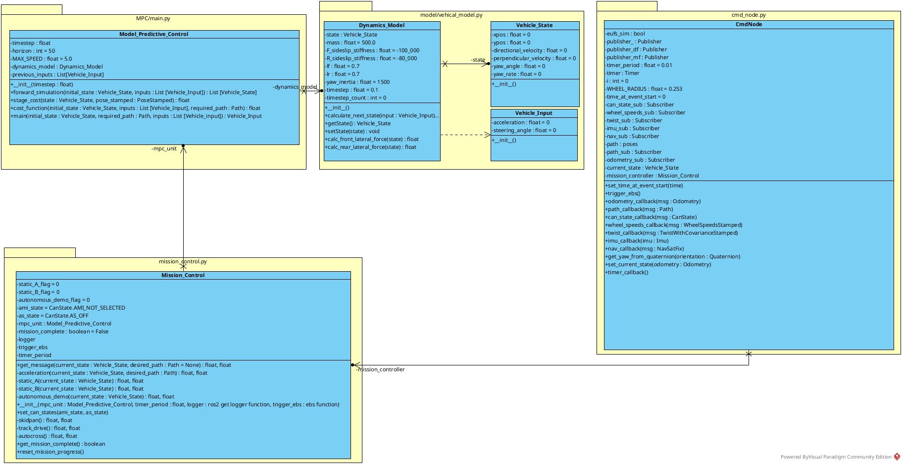
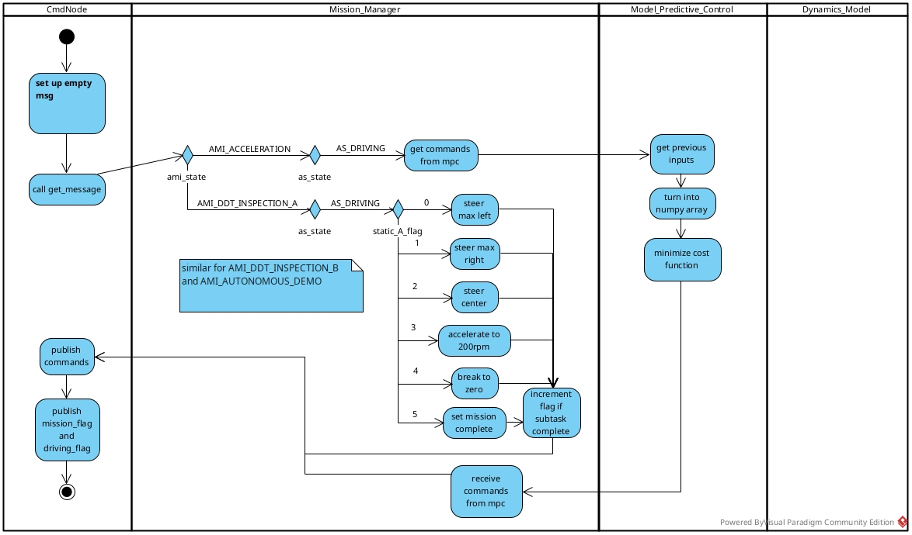
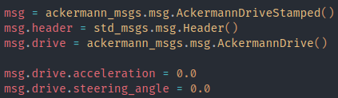
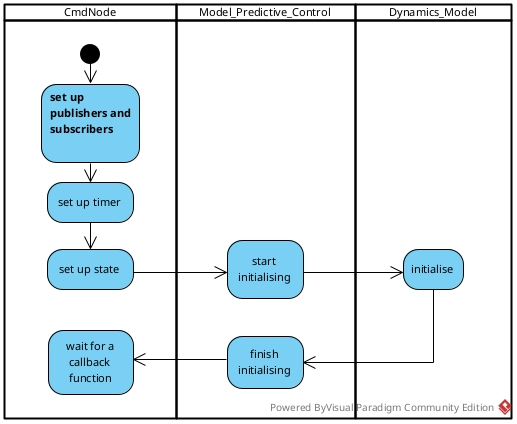
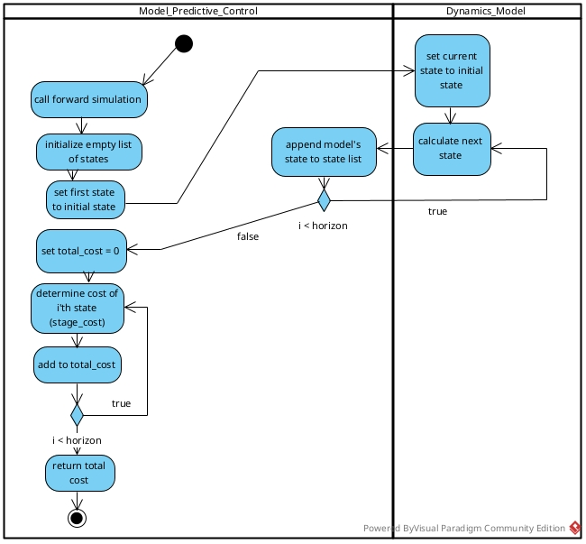
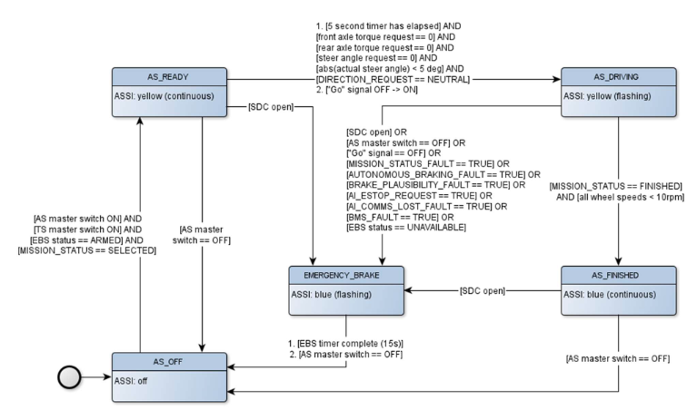

# How The Code Works (control)

## Main parts

The control system is split into two main parts, **ros_control**, and **ros_can**.

**ros_control** is in charge of deciding what the car needs to do.

**ros_can** is in charge of communicating with the car via the can bus.

These two parts communicate with each other (and the wider system) using **ros2**.
This guide will not go into detail on how ros works, for that consider checking out [these tutorials](https://docs.ros.org/en/humble/Tutorials.html).

## ros_control

ros_control is made up of 4 files – **MPC/main.py**, **model/vehical_model.py**, **mission_control.py**, and **cmd_node.py**. At the time of writing this, these are the only files that are used – there are other files that were used at some point during the development process but no longer are.

These files contain the classes shown above.

Descriptions of each class and their components are below.

This module is written in python.

### *CmdNode*

#### *Summary*

The command node is the class that contains the ros_control ros node, it is the class that sends and receives messages from ros_can, as well as path planning and perception.

CmdNode periodically runs timer_callback() which is where commands are published.

This class features lots of callback functions, if you don’t know what they you only really need to know that they are run automatically whenever we receive the right kind of message, or by the timer.

#### `timer_callback()`

Timer callback is run every self.timer_period seconds.

Its job is to create and publish the command message to the topic /cmd, as well as publish the mission complete flag and driving flag.

It does this by first creating an empty message, which will be filled out with commands later.

Next it asks the mission controller for the message it needs to send.

Finnaly it sends all the messages to `/cmd`, `/state_machine/driving_flag`, and `/ros_can/mission_complete`

#### `__init__()`

This is the constructor and is what is run first when the program starts, all ros2 subscribers and publishers are initialised here, and all the mission flags are set to their default values.

#### `set_time_at_event_start(time)`

This function is supposed to record the time(in number of iterations of timer_callback) when a mission subtask begins, so that the time since that can be measured.

#### `trigger_ebs()`

This function triggers the cars emergency braking system by making a request to the ros2 /ros_can/ebs service.

#### `odometry_callback(msg)`

A callback function for the /Odometry/slam ros subscription, this is run every time a new message received from this subscription.

This comes from perception and should contain data about the cars estimated position and orientation.

This function takes that data and passes it to the `set_current_state(odometry)` function.

#### `path_callback(msg)`

A callback function for the /planned_path ros subscription, this is run every time a new message is received from this subscription.

This comes from path_planning and should contain the desired path as a list of positions.

This function takes that data and sets self.path equal to this list of positions.

#### `can_state_callback(msg)`

A callback function for the /ros_can/state ros subscription, this is run every time a new message is received from this subscription.

This comes from ros_can and contains the cars AS_STATE and AMI_STATE, or in other words: what state the cars built in state machine is in, and what mission the car is on.

This function takes this data and sends it to the mission controller using self.mission_controller.set_can_states(can state)

#### `wheel_speeds_callback(msg)`

A callback function for the /ros_can/wheel_speeds ros subscription, this is run every time a new message is received from this subscription.
This comes from ros_can and contains the speeds of each wheel, as well as the steering angle.
This function takes an average of all 4 wheel speeds and records it in `self.wheels_rpm`, it also records the steering angle in `self.steering_angle_rad`.

NOTE: for some reason when using eufs_sim with gazebo (I haven’t tested in rVis), all wheels speeds are ~500rpm to high. No idea why this happens, but created a shitty workaround for it.

#### `twist_callback(msg)`

A callback function for the /ros_can/twist ros subscription, this is run every time a new message is received from this subscription.
This comes from ros_can and should contain the linear and angular velocity of the car, along with covariance.
**This has not been tested or verified yet, so I have no idea how accurate it is.** Info on how the message is made can be found in ros_can.cpp CanInterface::makeTwistMessage.

#### `imu_callback(msg)`

A callback function for the /ros_can/imu ros subscription, this is run every time a new message is received from this subscription.
This comes from ros_can and should contain data from the cars in built IMU (Inertial Measurement Unit) including the cars acceleration in 3d as well as the cars angular rotation in 3d.

NOTE: the cars default imu is known to not be very accurate or precise, and so this data should not be relied upon.

#### `nav_callback(msg)`

A callback function for the /ros_can/fix ros subscription, this is run every time a new message is received from this subscription.
This comes from ros_can and should contain data from the cars in built GPS.
This should include altitude, latitude and longitude in minutes with decimals.

NOTE: the cars default GPS is known to be quite imprecise (I think the figure is something like accurate to the nearest 2m?) so this REALLY shouldn’t be relied upon either.

#### `get_yaw_from_quaternion(orientation)`

This function SHOULD return the car’s yaw angle based on the given quaternion. I don’t know anything about quaternions so this function might be inaccurate or broken.

NOTE: **TESTING NEEDED**

#### `set_current_state(odometry)`

Sets the cars current state using self.mpc_unit.dynamics_model.set_state(state), after calculating the current state based on odometry.

NOTE: currently this uses ONLY odometry to calculate the state, and not data directly from the car like wheel speeds.

### *Model_Predictive_Control*

#### *Summary*

This class is in charge of the MPC algorithm.
It should predict an optimal set of commands to send to the car, based on the cars current state and the desired_path, and return the first of them.

#### `__init__(timestep, max_speed)`

The constructor.

Timestep must be given in seconds – this should be a fraction of a second (right now it is 0.01 which might be too small)

max_speed should be in m/s, and defaults to 5. This is included for safety reasons – the car should never accelerate to the point where it could still crash even with an estop.

#### `forward_simulation(initial_state, inputs)`

This function does what it says on the tin.
It creates a list of states based on the initial_state and inputs it is given.
It does this by calculating each new state using the Dynamics_Model and appending it to a list.

#### `stage_cost(state, input, pose_stamped, last)`

This function produces a cost for the state it is given.
This should punish being to far away from the line, being too slow, being over the max speed, sliding, and aggressive steering(high steering angle).

In the future I would like it to punish things like high jerk and fast direction changes.

#### `cost_function(initial_state,inputs,required_path)`

This function should calculate the cost of any given route.
It should do this based on the cost of each individual stage.

#### `main(initial_state,required_path,inputs[optional])`

This is the function that does the actual mpc.

First it should check to see if it has been given inputs to start with, if it hasn’t then it should try to use the previous inputs.
If there are no previous inputs, then it must mean that this is the first time MPC is run, and it should use empty inputs like Vehicle_Input(0,0).

Next it should check for a required_path – if one is not given then it is not safe to move, and the inputs should be zeros.

Next, it converts the list of inputs into a numpy array – this is because the scipy minimize function takes an array as an argument.

Next it creates the input bounds, this places restrictions on the range of values the optimizer will try, currently this is -5,5 for acceleration, and -0.5,0.5 for steering angle.

Next are 2 inner functions: unpack_inputs(u) which converts an array of inputs to a list of inputs, and objective(u) which unpacks the inputs and passes them to the cost function.

Next is where the inputs are actually optimised, we call the minimize function from scipy to do this.

Finally we return the first of the inputs.

### *Dynamics_Model*

#### *Summary*

This class contains the mathematical model of our car.
The basis for the model currently being used is in [this pdf](./Numerically_Stable_Dynamic_Bicycle_Model_for_Discrete-time_Control.pdf).

#### `__init__(timestep, state, input, mass, F_sideslip_stiffness, R_sideslip_stiffness, lf, lr, yaw_inertia, matplotlib)`

The constructor.

Timestep – the time between 2 consecutive states in seconds, by default it is 0.1.
F_sideslip_stiffness – (also called “front axle equivalent sideslip stiffness”) a constant measured in N/rad, default value of -100,000 – I don’t know what this is, but it is used to calculate the next state.

R_sideslip_stiffness – same as above but with a default value of -80,000

lf – the distance between the centre of gravity and the front axle

lr – the distance between the centre of gravity and the rear axle

yaw_inertia – measured in kg m^2, with a default value of 1500, I don’t know what this is but it is used to calculate the next state

Matplotlib is a boolean that determines whether the dynamics model will draw graphs for its predictions – this is false by default and should only be true if needed for testing.

#### `calc_front_lateral_force(steering_angle)`

This funtion returns the lateral force acting on the font axle in the model's current state.

To avoid a divide by zero error, if the directional velocity is 0, then we set it to 0.01.
This number is small enough that it probably wont have an impact on anything else.

#### `calc_rear_lateral_force()`

This is the same as `calc_front_lateral_force` only for the rear axle.

#### `calculate_next_state(input)`

This is the function that is used to calculate the next state of the model, based on the current state, and the given inputs.

NOTE: this returns void, self.state is updated instead

#### `set_state(state)`

This function sets the model's current state to whatever state was passed in.
This should be the current state of the car.

Currently this must be used before starting to generate a new prediction, otherwise the model's state and the real state wont match up.

### *Vehicle_Input*

#### *Summary*

A simple class that holds a value for desired acceleration (in m/s^2) and a value for desired steering angle (in radians).

In the future I would like to add getters to this and make the attributes private (not sure how to do private atts in python)

#### `__init__(acceleration, steering_angle)`

The construtor, simply sets the attributes equal to the parameters.

In the future I would like to add validation to this, to ensure only valid inputs are ever attempted.

### *Vehicle_State*

#### *Summary*

A simple class that represents a state.

Includes:

- x position
- y position
- directional velocity
- perpendicular velocity
- yaw angle
- yaw rate
- wheels average rpm
- steering angle in radians

#### `__init__(x_pos, y_pos, x_speed, y_speed, yaw_angle, yaw_rate, wheel_rpm, steering_angle_rad)`

Simply sets the attributes equal to the parameters

#### `__str__`

Returns a string that represents the current object, including all it values.

Usefull for debugging.

### *Mission_Control*

#### *Summary*

A class that handles mission logic including what the cars current goal should be.

It is in charge of figuring out what message should be sent to the car at any given time.

#### `__init__(mpc_unit, timer_period, logger, trigger_ebs)`

Sets flags to their defualt values.

`logger` should be the ros2 get_logger function, to allow this class to publish logs in the standard way

`trigger_ebs` should be the function that triggers the ebs - doing it this way allows this module to trigger the ebs ros service without waiting for returning a message to cmd node

#### `reset_mission_progress()`

Resets all the mission flags.
Should only be used at the end of a mission, once mission_complete has been set to true.

#### `__acceleration(current_state, desired_path)`

Handles the logic for the acceleration mission

Asks the mpc_unit for commands

CURRENTLY INCOMPLETE - car never stops, car doesn't know that it needs to stop within the orange cones

#### `__skidpan()`

NOT BUILT

#### `__track_drive()`

NOT BUILT

#### `__autocross()`

NOT BUILT

#### `__static_A(current_state)`

Handles the logic for the static inspection A mission (called DDT inspection A in eufs)

The mission is split into several sub-goals, each signified using the `static_A_flag` flag.

This is set up so that the car will keep trying to achieve the sub goal until the flag is updated.

#### `__static_B(current_state)`

Handles the logic for the static inspection B mission (called DDT inspection B in eufs)

Set up in a similar way to static A

#### `__autonomous_demo(current_state)`

Handles the logic for the autonomous demo mission

set up in a similar way to static A and B

**NOTE:** currently broken as shown in issue #20

#### `get_message(current_state, desired_path)`

This has a condition to figure out what mission the car is on, as the car will need to do different things based on that.

The missions that are currently built are ACCELERATION, DDT_INSPECTION_A(STATIC_INSPECTION_A), DDT_INSPECTION_B(STATIC_INSPECTION_B), and AUTONOMOUS_DEMO.

After it knows what mission its on, it needs to know what state the car is in.

The car has an inbuilt state machine:

The car will only respond to commands when it is in AS_DRIVING, additionally it will only transition into AS_DRIVING if all commands are 0.

Once it knows that it is allowed to send non 0 commands, then it can decide what needs to be done.

This is a different process for the static missions and autonomous demo than the main events, as the main events make use of the entire system, but the statics missions (and probably the autonomous demo) can be done without path_planning or perception.

##### Statics

The static missions make use of flags to track how far through the mission we are.
Because this function is called many times a second but we only want certain parts of it to run based on mission progress, I thought this was a relatively simple way to do this.

Because the code defaults to sending empty commands for safety reasons, every time timer_callback is called it must generate the correct command every time.

Once the missions sub-goal has been achieved it increments the flag. Once the mission has been fully complete it sets the mission complete flag.

##### Dynamics

Currently the only dynamic mission built is acceleration.

Dynamics do not currently use flags, but it would probably be a good idea in the future as some missions do have multiple stages, like how acceleration has to accelerate, but then also come to a stop in the correct place.

Currently, to check if the sim was working, acceleration overrides commands from MPC with predetermined values – **this must be changed at some point**.

## ros_can

This module is written in c/c++.

[ReadMe here](/Control/ros_can/README.md)

For more info about the api and car [try the FS-AI-API docs](/Control/ros_can/FS-AI-API/Docs)