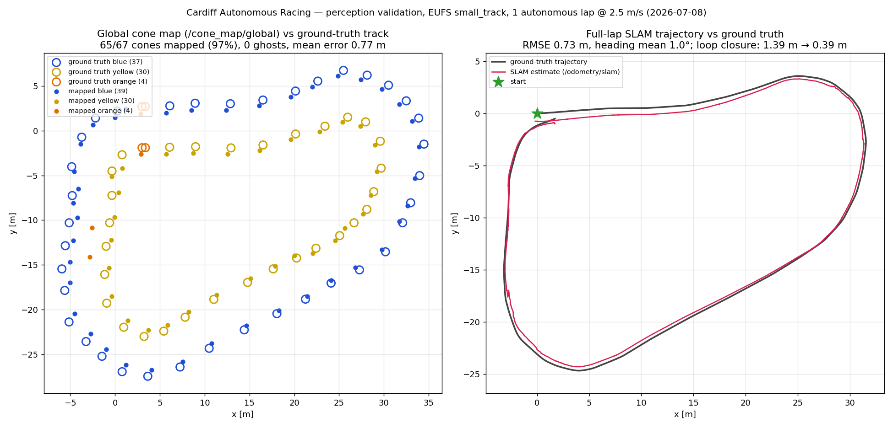

# Cardiff Autonomous Racing — Perception Stack

YOLOv8 cone detection + EKF landmark SLAM running on EUFS Formula Student simulation.

**SLAM**: landmark-based EKF-SLAM (Python, `landmark_slam` package).
Replaces the old ORB-SLAM3 node.  Drop-in: still publishes `/odometry/slam`.
Docker build time is now **~5 min** (was ~40 min).

**SLAM inputs** — the node fuses three things:

| Topic | Purpose |
|---|---|
| `/imu/data` | yaw rate → EKF prediction (required) |
| `/ros_can/twist` (real car) or `/gps_controller/vel` (sim) | forward velocity → EKF prediction (required) |
| `/cone_cloud/local` | YOLO cone detections → EKF correction |

The node listens to both velocity topics and automatically prefers the CAN
twist when it is alive, so the same command works in sim and on the car.
Without a velocity source the pose cannot translate and error grows with
every metre driven (it logs a warning if neither topic is publishing).

---

## Run with EUFS sim (Linux)

```bash
# 0. Allow X11 forwarding for RViz
xhost +local:docker

# 1. Build images (first time or after Dockerfile changes — now ~5 min)
docker build -f docker/Dockerfile.base       -t car-base       .
docker build -f docker/Dockerfile.perception -t car-perception .
docker build -f docker/Dockerfile.eufs_sim   -t car-eufs       .

# 2. Start containers
docker compose up -d base perception eufs_sim

# 3. Start YOLO cone detector (background)
#    (use_sim_time in sim only — omit it on the real car)
docker exec -d racing_perception bash -c "
   source /opt/ros/humble/setup.bash &&
   source /workspace/perception_ws/install/setup.bash &&
   ros2 run cone_detector YOLO_cone_detector --ros-args -p use_sim_time:=true"

# 4. Start cone mapper (background)
docker exec -d racing_perception bash -c "
   source /opt/ros/humble/setup.bash &&
   source /workspace/perception_ws/install/setup.bash &&
   ros2 run cone_mapper cone_mapper --ros-args -p use_sim_time:=true"

# 5. Start landmark SLAM node (replaces ORB-SLAM3)
docker exec -d racing_perception bash -c "
   source /opt/ros/humble/setup.bash &&
   source /workspace/perception_ws/install/setup.bash &&
   ros2 run landmark_slam landmark_slam --ros-args -p use_sim_time:=true"

# 6. Verify all topics are flowing
docker exec racing_perception bash -c "
   source /opt/ros/humble/setup.bash &&
   ros2 topic hz /odometry/slam"
docker exec racing_perception bash -c "
   source /opt/ros/humble/setup.bash &&
   ros2 topic hz /cone_cloud/local"
docker exec racing_perception bash -c "
   source /opt/ros/humble/setup.bash &&
   ros2 topic hz /cone_map/local"
```

**RViz displays to add:**
- `/ground_truth/cones` → ConeArrayWithCovariance (simulator ground truth)
- `/yolo_annotated_image` → Image (camera with bounding boxes)
- `/cone_map/markers` → MarkerArray (built cone map)

---

## Validate SLAM accuracy against ground truth

In a separate terminal inside the perception container:

```bash
docker exec -it racing_perception bash -c "
   source /opt/ros/humble/setup.bash &&
   source /workspace/perception_ws/install/setup.bash &&
   python3 /workspace/scripts/validate_slam.py"
```

This prints live position error vs `/ground_truth/odom` and a final RMSE
summary when you press Ctrl-C.  Target: **position RMSE < 0.5 m**.
Both trajectories are expressed relative to their first pose before
comparison (SLAM starts at the origin; sim ground truth starts at the
spawn pose).

### Full-lap validation (one command)

```bash
./scripts/run_lap_validation.sh 1 2.5   # laps, target speed m/s
```

Drives the car around the track with a test-only pure-pursuit driver
(ground-truth centerline — no path planning / control involved), then
validates SLAM pose and the built cone map against ground truth.

Latest result (small_track, 1 lap @ 2.5 m/s, 2026-07-08):
**pose RMSE 0.73 m** (loop closure verified: 1.39 m → 0.39 m),
**cone map 65/67 (97%) mapped, 0 ghosts**, planner-format check OK.



---

## Run unit tests (no ROS required)

```bash
# Option A: Inside the perception container with colcon
docker exec -it racing_perception bash -c "
   source /opt/ros/humble/setup.bash &&
   cd /workspace/perception_ws &&
   colcon test --packages-select landmark_slam &&
   colcon test-result --verbose"

# Option B: Directly with pytest (faster, no ROS install needed)
cd perception_ws/src/landmark_slam
pip install pytest numpy
pytest test/ -v
```

Expected output: all tests **PASSED** (71 tests).

---

## Landmark SLAM parameters

All tunable via `--ros-args -p <name>:=<value>`:

| Parameter | Default | Description |
|---|---|---|
| `obs_noise_xy` | `0.5` | Std-dev (m) of YOLO cone detection noise |
| `process_noise_xy` | `0.1` | Position prediction noise (m/√s) |
| `process_noise_yaw` | `0.05` | Heading prediction noise (rad/√s) |
| `camera_x_offset` | `0.0` | Camera forward offset from car ref (m) — set once measured |
| `camera_y_offset` | `0.0` | Camera lateral offset (m) |
| `max_cone_range` | `15.0` | Ignore detections beyond this depth (m) |
| `min_cone_range` | `0.5` | Ignore detections closer than this (m) |

Real-car example (after measuring camera mount):
```bash
ros2 run landmark_slam landmark_slam \
   --ros-args -p camera_x_offset:=0.35 -p obs_noise_xy:=0.4
```

---

## Minimal Troubleshooting

- No `/odometry/slam`: check `landmark_slam` is running and `/imu/data` exists.
- `/odometry/slam` exists but position stays near zero while driving: no
  velocity source — check `/gps_controller/vel` (sim) or `/ros_can/twist`
  (real car) is publishing. The node warns about this at startup.
- No cones: check `/zed/left/image_rect_color`, `/zed/depth/image_raw`, and `best.pt` exists.
- No map output: check `/cone_cloud/local` first, then `/cone_map/local`.

Useful checks:

```bash
docker exec racing_perception bash -c "source /opt/ros/humble/setup.bash && ros2 node list | grep -E 'landmark_slam|cone_mapper|yolo'"
docker exec racing_perception bash -c "source /opt/ros/humble/setup.bash && ros2 topic hz /odometry/slam"
docker exec racing_perception bash -c "source /opt/ros/humble/setup.bash && ros2 topic echo /cone_map/local --once"
```

**Build time note:** `car-perception` builds in roughly 5 minutes.